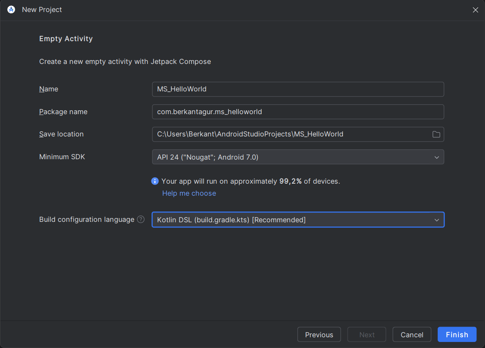
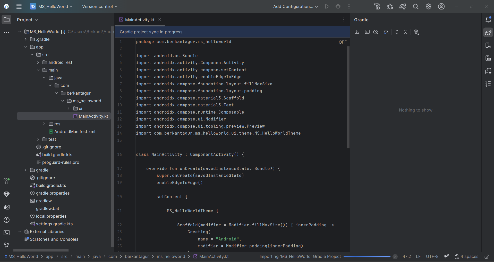
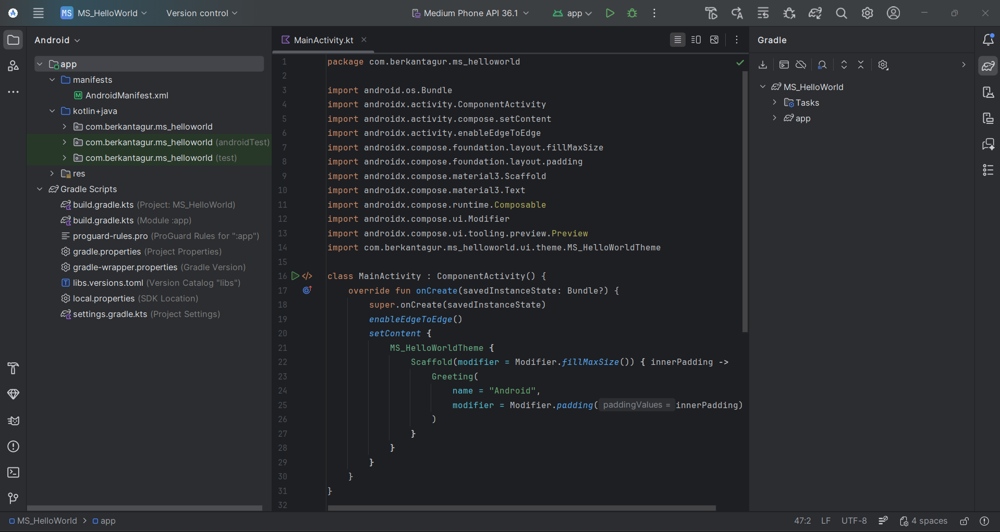
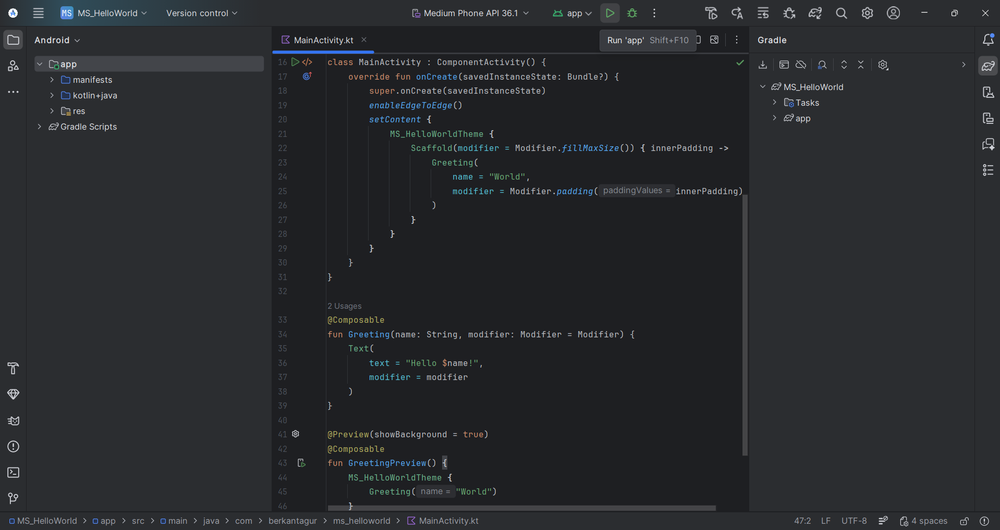
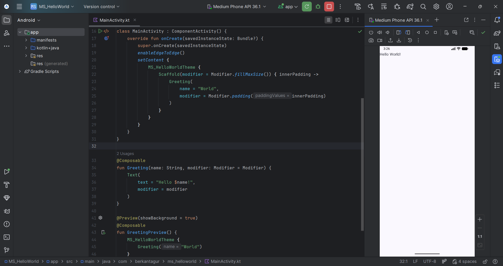

# PROJECT 1: HelloWorld (Basic Version)
*Hello World: setup Android Studio IDE, compile first app that displays just a hello world text on the screen.*

This repository contains the **Basic Hello World** Android application created for the **Mobile Systems** course.

The goal of this project is to verify that:
- Android Studio is correctly set up,
- the project can be synchronized with Gradle,
- the application can be compiled and executed on an emulator/device,
- a simple text (**"Hello World!"**) is displayed on the screen.

---

## 🪢 Tech Stack

- **Language:** Kotlin
- **UI:** Jetpack Compose (Empty Activity template)
- **Build System:** Gradle (Kotlin DSL - `build.gradle.kts`)
- **Minimum SDK:** API 24 (Android 7.0)

---

## 👾 Project Steps

> The screenshots below document the full workflow from project creation to execution.

### Project creation

### Project structure & initial setup

### Gradle synchronization

### Running the application

### Final output

---

## 🚀 Key Source File

- `app/src/main/java/com/berkantagur/ms_helloworld/MainActivity.kt`

---

## 📱 Notes

- This is the **Basic Version** focusing only on environment setup and a minimal UI output.
- Build artifacts such as `**/build/`, `.gradle/`, and machine-specific files like `local.properties` should not be committed to Git.

---

## 🎄 Summary

In this basic assignment, I created a new Android project using the **Empty Activity (Jetpack Compose)** template in Android Studio, completed the **Gradle synchronization**, and successfully **built and ran** the application on an Android emulator. The final result is a single-screen app that displays the text **"Hello World!"**, confirming that the development environment and build pipeline are correctly configured.

---

## 🫡 Advanced Version

A more structured and modern UI implementation of the same “Hello World” task is available in the **Advanced Version** repository.

In the advanced version:
- the default template `Greeting()` composable was removed,
- a dedicated screen-level composable (`HelloWorldScreen`) was introduced,
- Material 3 UI components (e.g., `Card`) and typography were used to create a more polished interface.

➡️ **[Advanced repository](https://github.com/Berkantagur/Mobile-Systems-PB/tree/main/Project1_HelloWorld_Advanced)**
