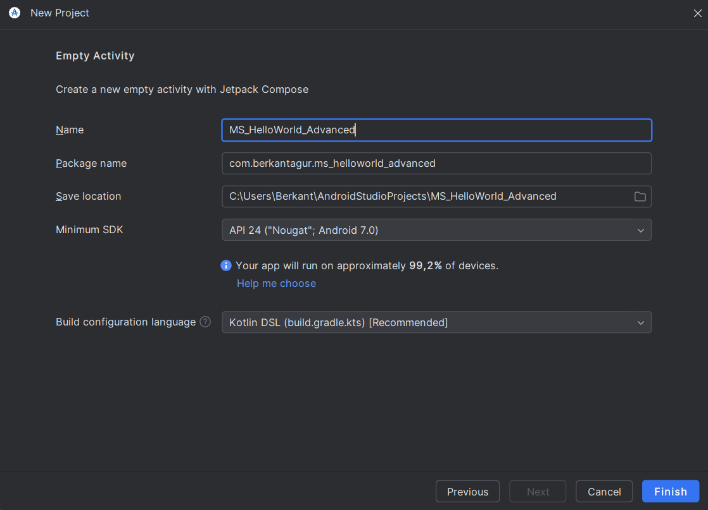
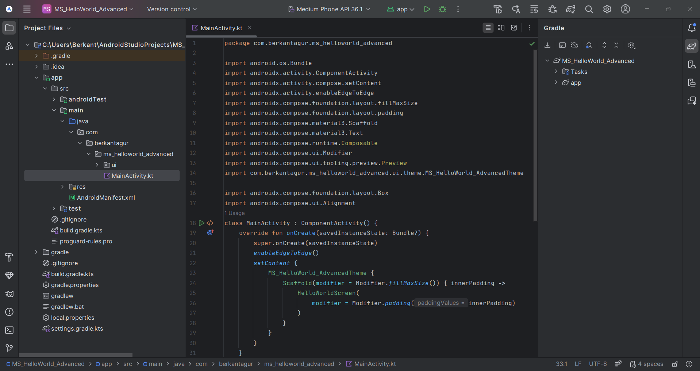
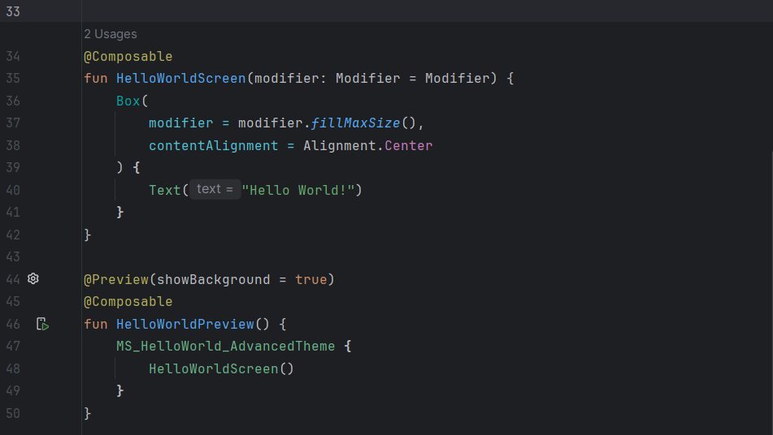
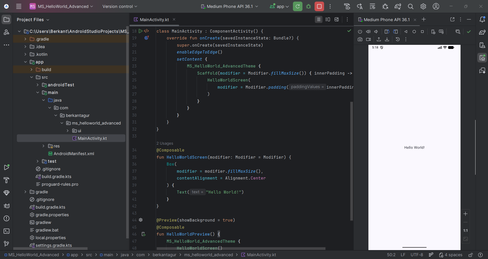
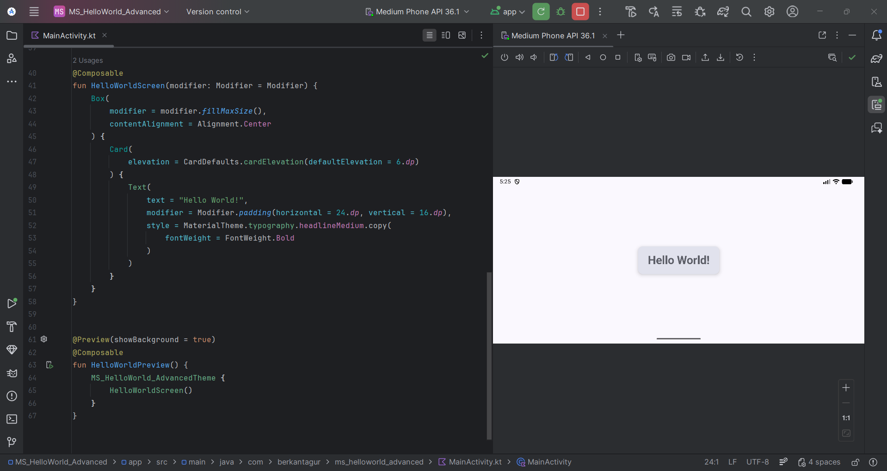

# Project 1: Hello World (Advanced Version)
*Hello World: setup Android Studio IDE, compile first app that displays just a hello world text on the screen.*

This repository contains the **Hello World** Android application created for the **Mobile Systems** course.

---

## 🚀 Project Goal

- Create and run a first Android app in Android Studio.
- Display **Hello World!** on the screen.
- Improve code structure by replacing the default template composable with a screen-based composable.
- Apply small modern UI improvements using Material 3 components.
---

## 🪢 Tech Stack

- **Language:** Kotlin
- **UI:** Jetpack Compose + Material 3
- **Build System:** Gradle (Kotlin DSL - `build.gradle.kts`)
- **Minimum SDK:** API 24 (Android 7.0)
- **Test Device:** Android Emulator (Medium Phone API 36.1)

---

## 📱 What Is Different From the Basic Version?

This advanced version differs from the basic version in two main aspects:
- the **composable structure** (screen-based UI design),
- the **UI styling** (Material 3 Card + typography).

### 1) Screen-based composable structure (Refactor)

In the basic version, the default template uses a small composable called `Greeting(name)` that directly renders a `Text`.
In the advanced version, this was refactored into a **screen-level composable** called `HelloWorldScreen()`.
A screen-level composable acts as a dedicated UI entry point for the screen, which is easier to extend later (adding more UI elements, state, navigation, etc.).

#### Before (Basic): `Greeting(name)` composable
```kotlin
class MainActivity : ComponentActivity() {
    override fun onCreate(savedInstanceState: Bundle?) {
        super.onCreate(savedInstanceState)
        enableEdgeToEdge()
        setContent {
            MS_HelloWorldTheme {
                Scaffold(modifier = Modifier.fillMaxSize()) { innerPadding ->
                    Greeting(
                        name = "World",
                        modifier = Modifier.padding(innerPadding)
                    )
                }
            }
        }
    }
}

@Composable
fun Greeting(name: String, modifier: Modifier = Modifier) {
    Text(
        text = "Hello $name!",
        modifier = modifier
    )
}
```

Characteristics of the basic approach: 
- `Greeting(name)` is generic but very minimal.
- The UI is a single Text element with no layout container.
- The output placement is determined only by the provided `modifier` (here: `padding(innerPadding)`).


#### After (Advanced): `HelloWorldScreen()` composable
```kotlin
@Preview(showBackground = true)
@Composable
fun GreetingPreview() {
    MS_HelloWorldTheme {
        Greeting("World")
    }
}

After (Advanced): HelloWorldScreen() composable
class MainActivity : ComponentActivity() {
    override fun onCreate(savedInstanceState: Bundle?) {
        super.onCreate(savedInstanceState)
        enableEdgeToEdge()
        setContent {
            MS_HelloWorld_AdvancedTheme {
                Scaffold(modifier = Modifier.fillMaxSize()) { innerPadding ->
                    HelloWorldScreen(
                        modifier = Modifier.padding(innerPadding)
                    )
                }
            }
        }
    }
}

@Composable
fun HelloWorldScreen(modifier: Modifier = Modifier) {
    // Screen-level composable: the main UI entry point for this screen
}
```

Why this is better for extension ?
HelloWorldScreen() becomes the single place to manage the screen layout. Later additions are straightforward:
- state holders (remember, mutableStateOf)
- more composables (buttons, inputs, lists)
- navigation (multiple screens)
- separation into UI components (e.g., Header(), Content(), Footer())


### 2) Modern UI styling with Material 3 (Card + Typography)
In the basic version, only a plain Text was shown. 
In the advanced version, the UI was improved using:

- `Box` for layout and centering,
- `Card` for a modern container (surface + elevation),
- Material 3 typography (`headlineMedium`) and `FontWeight.Bold`,
- explicit padding to make spacing consistent.

#### Before (Basic): plain Text
```kotlin
@Composable
fun Greeting(name: String, modifier: Modifier = Modifier) {
    Text(
        text = "Hello $name!",
        modifier = modifier
    )
}
```

#### After (Advanced): centered content + Card container
```kotlin
@Composable
fun HelloWorldScreen(modifier: Modifier = Modifier) {
    Box(
        // fills the screen and allows controlled positioning
        modifier = modifier.fillMaxSize(),
        // centers the child composable inside the Box
        contentAlignment = Alignment.Center
    ) {
        Card(
            // adds elevation/shadow for a modern UI look
            elevation = CardDefaults.cardElevation(defaultElevation = 6.dp)
        ) {
            Text(
                text = "Hello World!",
                // internal spacing so the text is not flush against card edges
                modifier = Modifier.padding(horizontal = 24.dp, vertical = 16.dp),
                // uses Material 3 typography + bold weight
                style = MaterialTheme.typography.headlineMedium.copy(
                    fontWeight = FontWeight.Bold
                )
            )
        }
    }
}
```

What each UI element contributes?
- `Box(fillMaxSize)` creates a full-screen layout container.
- `contentAlignment = Alignment.Center` centers the child (the Card) on the screen.
- `Card(elevation = ...)` provides a Material container with shadow (visual hierarchy).
- `MaterialTheme.typography.headlineMedium` ensures the font sizing follows the app theme.
- `FontWeight.Bold` makes the text visually stronger for a “title-like” appearance.
- `Modifier.padding(...)` ensures consistent spacing and a clean layout.
---

## 🕺🏼Project Steps

### Project creation (Advanced project)


### MainActivity and project structure


### Refactor View (HelloWorldScreen)


### Output on Emulator (Hello World)


### Modern UI (Material 3 Card + Typography)


---

## 🧩Key Source File

- `app/src/main/java/com/berkantagur/ms_helloworld_advanced/MainActivity.kt`

---

## ✨ Summary

In this advanced assignment, I created a Compose-based Android project and refactored the default template by removing the generated `Greeting()` function and implementing a dedicated `HelloWorldScreen()` composable. I also improved the UI using Material 3 components (Card, elevation, padding) and typography to produce a cleaner and more modern Hello World interface. The project builds successfully with Gradle and runs correctly on an Android emulator.

