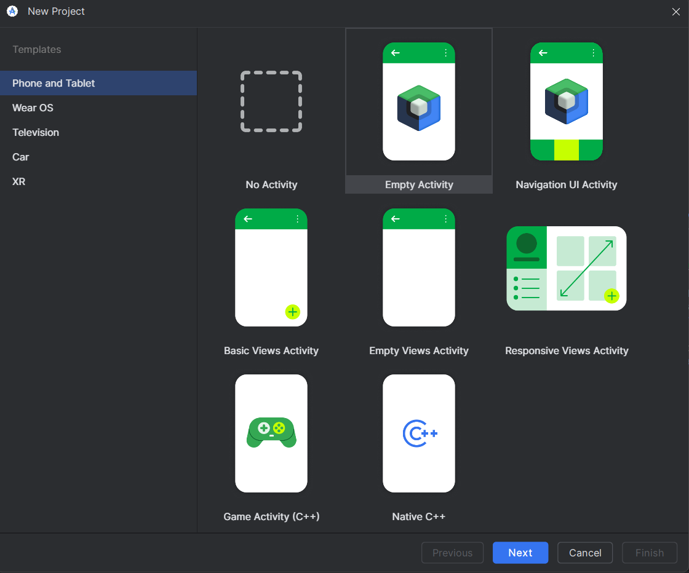
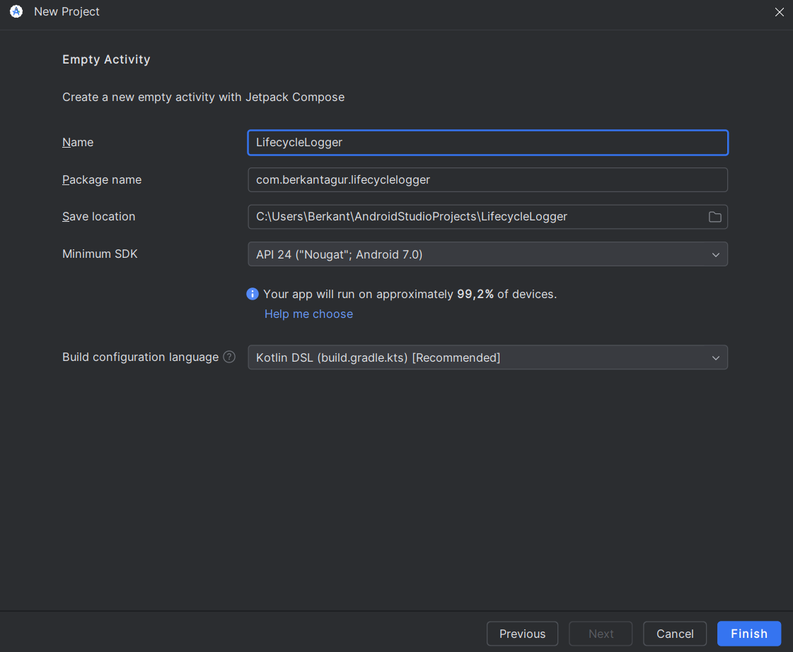
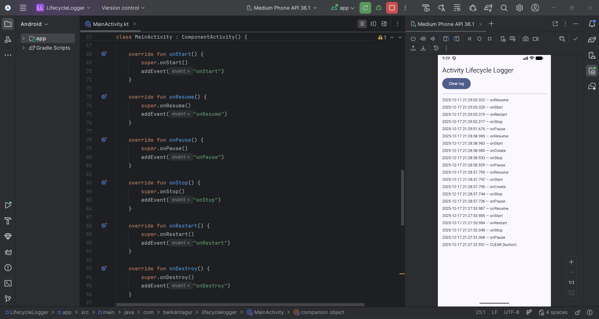
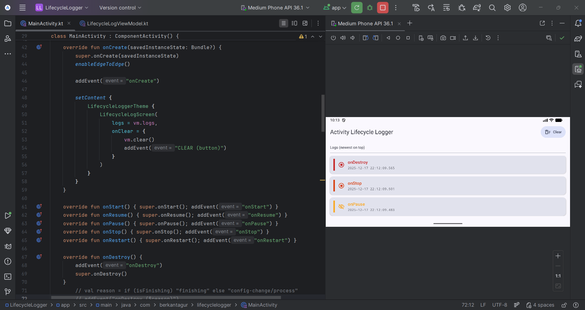
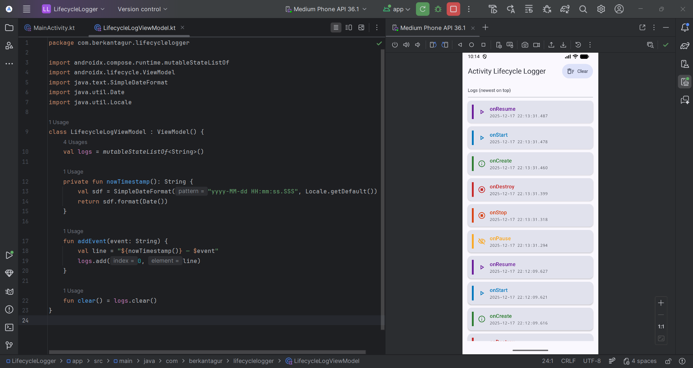
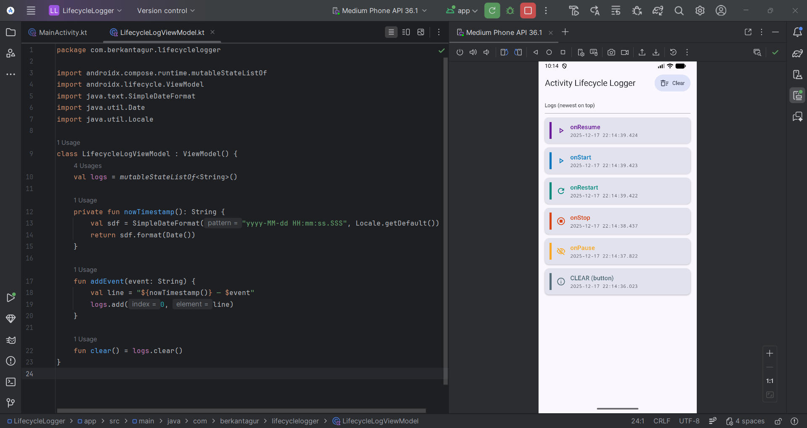

# Project 2: LifecycleLogger (Activity Lifecycle Logger)

An Android application built with **Kotlin** and **Jetpack Compose** that logs **Activity lifecycle events** directly on screen with a **timestamp**, and also prints the same events to **Logcat**.

This project was created for the **Mobile Systems** course to demonstrate how an Activity transitions through lifecycle states during typical user interactions (launch, background/foreground, rotation, exit).

---

## 🧩 Objectives

- Demonstrate core Activity lifecycle callbacks:
  - `onCreate()`, `onStart()`, `onResume()`, `onPause()`, `onStop()`, `onRestart()`, `onDestroy()`
- Display **date + time** for each event on the UI.
- Observe how lifecycle behavior differs for:
  - App launch
  - Home / background
  - Returning from Recents
  - Screen rotation (configuration change)
  - Back / exit

---

## ❄️ Features

- Lifecycle events displayed **on screen** (newest on top).
- Each event displayed as a **colored card** for readability during presentations.
- **Clear** button to reset the log list.
- Logs also printed to **Logcat** (tag: `LifecycleLogger`).
- Uses a **ViewModel** (`LifecycleLogViewModel`) to store UI state (log list).

---

## 🪢 Tech Stack

- **Kotlin**
- **Jetpack Compose (Material 3)**
- **AndroidX Lifecycle ViewModel**

---

## 📱 Setup (Android Studio)

### Project creation
Template: **Empty Activity (Jetpack Compose)**  
Minimum SDK: **API 24 (Android 7.0 / Nougat)**  
Build configuration language: **Kotlin DSL (build.gradle.kts)**

---

## 🛞 Dependency Note (Material Icons)

This project uses Material icon vectors (`Icons.Outlined.*`). Ensure the following dependency exists in:

**`app/build.gradle.kts`** inside `dependencies { }`

```kotlin
implementation("androidx.compose.material:material-icons-extended")
```

Sync Gradle after adding it.

---

## 🕺🏼 How to Run

1. Open the project in **Android Studio**
2. **Sync Gradle**
3. Run on an **Emulator** or a physical Android device
4. Watch the lifecycle events appear on screen
5. Optionally open **Logcat** and filter by tag `LifecycleLogger`

---

## 🚀 Testing Scenarios (Recommended for Presentation)

### 1) App Launch (cold start)
Typical sequence:
- `onCreate → onStart → onResume`

### 2) Press Home (background the app)
Typical sequence:
- `onPause → onStop`

Return to the app from Recents:
- `onRestart → onStart → onResume`

### 3) Rotate the screen (configuration change)
Typical sequence:
- Old Activity instance: `onPause → onStop → onDestroy`
- New Activity instance: `onCreate → onStart → onResume`

Rotation is a common case where `onDestroy()` happens even though the user did not “exit” the app.

### 4) Press Back (finish the Activity)
Often:
- `onPause → onStop → onDestroy`

Note: `onDestroy()` is not guaranteed in all system conditions, but for a normal Back exit it typically appears.

---

## 🚥 Code Overview

### `MainActivity.kt`
- Overrides lifecycle callbacks and logs each event via `addEvent("onX")`.
- UI is implemented with Compose (`Scaffold`, `TopAppBar`, `LazyColumn`).
- Clear action resets the list via ViewModel.

### `LifecycleLogViewModel.kt`
- Holds logs as `mutableStateListOf<String>()` so Compose updates automatically.
- Generates timestamps using `SimpleDateFormat`.
- Storing logs in the ViewModel helps preserve UI state across configuration changes.

---

## 🏁 Project Steps

Place screenshots in a folder named **`screenshots/`** at the repository root (same level as this README):

### New Project Templates Screen


### Project Configuration Screen


### App Running with Logs


### Lifecycle Events After Interaction


### More Lifecycle Transitions


### Example Showing Lifecycle Changes Including `onDestroy`


### Final UI


---

## ✨ References

- Activity lifecycle: https://developer.android.com/guide/components/activities/activity-lifecycle
- Android Docs: https://developer.android.com/docs
- Android Studio: https://developer.android.com/studio

## 🔥 Summary (What I Built?)

In this project, I implemented a simple Android app that displays the **Activity lifecycle events** in real time.  
Each callback (e.g., `onCreate`, `onStart`, `onResume`, etc.) is logged with an exact **timestamp** and shown on screen as a colored card. The same events are also printed to Logcat for verification.

The app is intentionally minimal, focusing on clearly demonstrating how Android transitions between lifecycle states based on user actions such as launching the app, pressing Home, returning from Recents, rotating the device, and exiting with Back.

---

## 🍂 What I Learned?

- **How the Activity lifecycle works in practice**  
  I learned the typical event order during app start (`onCreate → onStart → onResume`) and when moving to background (`onPause → onStop`) and returning (`onRestart → onStart → onResume`).

- **Why `onDestroy()` is not always triggered (or not always visible)**  
  Pressing **Home** usually does not destroy the Activity; it only stops it, so `onDestroy()` is not expected.  
  Screen rotation often triggers `onDestroy()` because it is a **configuration change** and the Activity is recreated.

- **Why state should not be stored directly inside the Activity**  
  I used a **ViewModel** to store the log list. This helped preserve UI state across configuration changes and made the UI reactive and stable.

- **Jetpack Compose state updates**  
  Using `mutableStateListOf` allowed the UI to update automatically whenever a new lifecycle event was added.

- **Practical debugging with Logcat**  
  I learned to confirm lifecycle callbacks using Logcat filters (tag `LifecycleLogger`), which is especially useful for events like `onDestroy()` during app exit.

